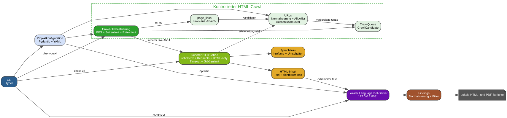

# tu-web-linguacheck

`tu-web-linguacheck` ist ein freies, lokal ausführbares Python-Werkzeug zur
Prüfung öffentlich erreichbarer Websites auf Rechtschreibung, Grammatik und
Zeichensetzung.

Das Projekt crawlt ausschließlich erlaubte Domains, extrahiert sichtbare
HTML-Inhalte und prüft diese lokal. PDF-Dateien werden nicht verarbeitet.

## Ziele

- öffentlich erreichbare HTML-Seiten crawlen
- sichtbaren Inhalt bevorzugt aus `<main>` extrahieren
- Navigation, Footer, Cookie-Banner, Skripte und Styles ignorieren
- Rechtschreibung, Grammatik und Zeichensetzung lokal prüfen
- HTML- und CSV-Berichte erzeugen
- Crawl-Regeln und Prüfprofile konfigurierbar machen
- robots.txt standardmäßig beachten
- keine Website-Inhalte an externe Cloud-KI- oder Sprachprüfungs-APIs senden

## Befehlsübersicht

Die vollständige Referenz liefert jeweils:

```bash
tu-web-linguacheck COMMAND --help
```

- `inspect`: Sprachlinks einer erlaubten HTML-Seite anzeigen.
  Erfordert `URL`, `--allowed-domain DOMAIN` und `--source-language SPRACHE`.
- `check-text`: Text direkt mit dem lokalen LanguageTool-Server prüfen.
  Erfordert `TEXT`, `--language CODE`, `--url URL` und `--profile PROFIL`.
- `validate-config`: Eine lokale YAML-Konfiguration laden und validieren.
  Erfordert `CONFIG_PATH`.
- `check-url`: Genau eine erlaubte HTML-Seite prüfen.
  Erfordert `URL CONFIG_PATH`; optional sind `--report DATEI.html` und
  `--pdf-report DATEI.pdf`.
- `check-crawl`: Erlaubte HTML-Seiten crawlen und sichtbare Texte prüfen.
  Erfordert `URL CONFIG_PATH`; optional sind `--stay-under-start-path`,
  `--report DATEI.html` und `--pdf-report DATEI.pdf`.
- `check-translation`: Deutsche Begriffe gegen die englische Sprachversion
  einer Seite prüfen. Erfordert `URL CONFIG_PATH`; optional sind
  `--report DATEI.html` und `--pdf-report DATEI.pdf`.

Schnellstart für eine einzelne Seite:

```bash
tu-web-linguacheck check-url URL CONFIG_PATH --report DATEI.html
```

## Architektur

Die Architekturübersicht zeigt die aktuell implementierten Komponenten,
Sicherheitsgrenzen und lokalen Berichtswege.



Die bearbeitbare Diagrammquelle liegt in `docs/architecture.dot`. Das SVG wird
lokal mit `tools/generate_architecture_diagram.sh` erzeugt.

## Geplante Prüfprofile

- `generic-de`: Deutsche private Websites: Rechtschreibung, Grammatik,
  Zeichensetzung und ungewöhnliche Wörter.
- `tu-de`: Deutsche TU-Dortmund-Websites: zusätzlich Whitelists,
  Terminologie- und Stilregeln.
- `tu-en`: Englische TU-Dortmund-Websites: LanguageTool mit `en-US`,
  TU-Terminologie und englische Stilregeln.

## Geplanter Technologiestack

- Python 3.12
- Scrapy
- BeautifulSoup4 und lxml
- lokaler LanguageTool-Server
- Typer
- Pydantic
- Jinja2
- PyYAML
- pytest
- Ruff

## Datenschutz und lokale Verarbeitung

Website-Texte, Crawl-Daten und Prüfergebnisse bleiben lokal. Das Projekt nutzt
keine externen Cloud-KI- oder Sprachprüfungs-APIs.

Die Verzeichnisse `data/` und `reports/` enthalten lokale Laufzeitdaten und
generierte Berichte. Ihre Inhalte werden nicht in Git eingecheckt.

## Projektstatus

Das Projekt befindet sich im Aufbau. Aktuell existieren die grundlegende
Repository-Struktur und die Projektdokumentation. Der Crawler und die
Sprachprüfung sind noch nicht implementiert.

## Lizenz

Dieses Projekt steht unter der [MIT-Lizenz](LICENSE).
